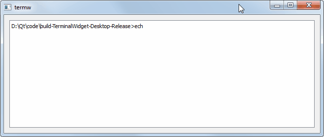

# Terminal Widget
A simple terminal mocking widget for Qt.

## Overview


The class `TermWidget` provides a simple interface to interact with 
a terminal application.

It is compatible with both the Windows and Linux operating systems.

## API Documentation
### Public Slots
```
int  setTextCursorAtInput();
int  setTextCursorAtEnd();
```
Moves the cursor to the end of terminal output (begin of user input) 
or to the end of both output and input (end of user input).

```
void paste();
```
Tries to paste from the system clipboard to user input.

```
void execute();
```
Begin execution of the terminal application.

```
void processInput();
```
Sends all user input to the terminal application.

### Protected Slots
```
void processOutput();
```
Triggers when the terminal application's output is available, reads 
it, and appends it to the widget.

```
void finished(int exitCode, QProcess::ExitStatus exitStatus);
```
Triggers when terminal application execution is finished. Appends to 
the widget information about the exit code.

```
void error(QProcess::ProcessError error);
```
Triggers when terminal application execution fails for some reason. 
Appends to the widget information about the error.

## License
The `TermWidget` class is released under the MIT open source license 
([MIT License](https://opensource.org/license/mit/)).

